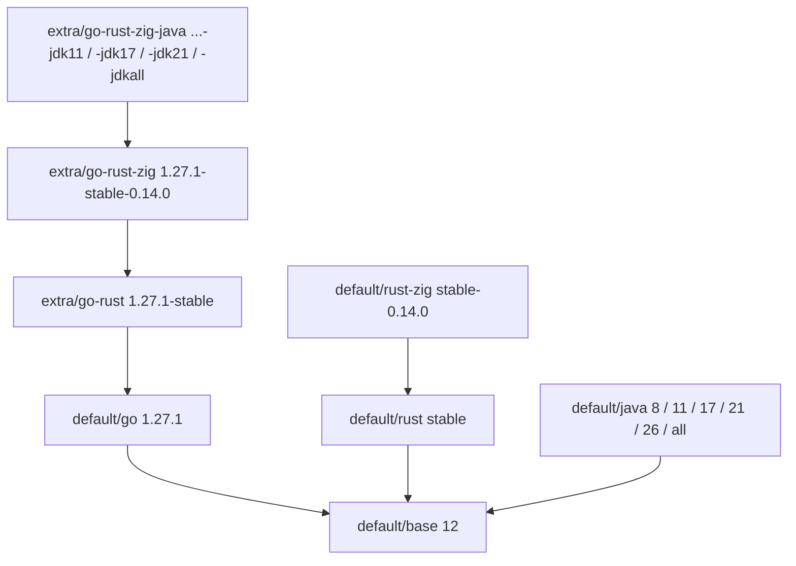

# Agents Docker Images

> Docker toolchain images for AI coding agents — batteries included, built by a data-driven `maketool.sh` and published via GitHub Actions.

The project ships a set of layered, versioned Docker images (`base`, `Go`, `Rust`, `Rust+Zig`, single-JDK `Java`) plus ready-made **combinations** (`extra/*`) such as a full Go + Rust + Zig + Java workspace. Every image is defined by a small `.meta` file — the single source of truth — and images are built, validated and published by `./maketool.sh`.

---

## Highlights

- **16 images, 1 command to build them all** — `./maketool.sh build` discovers every image from its `.meta` file.
- **Versions reflect toolchains** — image tags mirror the primary component (`go:1.27.1`, `java:17`); combination images use a full composite version (`go-rust-zig-java:1.27.1-stable-0.14.0-jdk21`).
- **Dependency-aware builds** — `PARENT=` in `.meta` drives build ordering and `BASE_IMAGE` propagation; it accepts internal image ids (`<key>/<version>`) or any foreign docker ref (passed through verbatim).
- **Bring your own images** — the build tool is self-contained; run it in any repo with its
  own `dockerfiles/` tree straight from GitHub, no clone needed
  (`bash <(curl -fsSL https://raw.githubusercontent.com/alexundros/agents-docker-images/main/maketool.sh) build`).
- **Reuse instead of copy** — `DOCKERFILE=` in `.meta` lets an image reuse an existing Dockerfile (all `java` versions share one; see `extra/*`).
- **Idempotent publishing** — already-published tags are skipped via a registry manifest probe; overwrite only with `ALLOW_OVERWRITE=true`.
- **Change-aware CI** — GitHub Actions builds and pushes only images affected by a commit (plus their transitive dependents).
- **Safe by default** — non-root `coder` user, pinned toolchain versions, cached archives removed after install, multi-arch (amd64/arm64).

---

## Available images

Image version = the version of its key component (`rust` tracks the `stable` channel;
`rust-zig` uses a composite `rust`-`zig` version; `java/all` bundles every JDK). `extra/*` composite
versions list components in fixed order: `go`-`rust`-`zig`-`jdk`.

| Image                    | Version                       | Contents                                                                | Built on            | Pull                                                                                               |
| ------------------------ | ----------------------------- | ----------------------------------------------------------------------- | ------------------- | -------------------------------------------------------------------------------------------------- |
| `default/base`           | `12`                          | Debian 12 slim, common CLI/editors/debug tools, Python 3, Node.js 22    | debian:12-slim      | `docker pull ghcr.io/alexundros/agents-docker-images/base:12`                                      |
| `default/go`             | `1.27.1`                      | Go 1.27.1 (official tarball, trimmed)                                   | `default/base`      | `docker pull ghcr.io/alexundros/agents-docker-images/go:1.27.1`                                    |
| `default/rust`           | `stable`                      | Rust `stable` via rustup (minimal), gnu + musl targets, C toolchain     | `default/base`      | `docker pull ghcr.io/alexundros/agents-docker-images/rust:stable`                                  |
| `default/rust-zig`       | `stable-0.14.0`               | Zig 0.14.0 (mirror-fallback) + cargo-zigbuild 0.23.3                    | `default/rust`      | `docker pull ghcr.io/alexundros/agents-docker-images/rust-zig:stable-0.14.0`                       |
| `default/java`           | `8`                           | Single JDK 8 (Temurin), Maven, Gradle                                   | `default/base`      | `docker pull ghcr.io/alexundros/agents-docker-images/java:8`                                       |
| `default/java`           | `11`                          | Single JDK 11 (Temurin), Maven, Gradle                                  | `default/base`      | `docker pull ghcr.io/alexundros/agents-docker-images/java:11`                                      |
| `default/java`           | `17`                          | Single JDK 17 (Temurin), Maven, Gradle                                  | `default/base`      | `docker pull ghcr.io/alexundros/agents-docker-images/java:17`                                      |
| `default/java`           | `21`                          | Single JDK 21 (Temurin), Maven, Gradle                                  | `default/base`      | `docker pull ghcr.io/alexundros/agents-docker-images/java:21`                                      |
| `default/java`           | `26`                          | Single JDK 26 (Temurin), Maven, Gradle                                  | `default/base`      | `docker pull ghcr.io/alexundros/agents-docker-images/java:26`                                      |
| `default/java`           | `all`                         | JDK 8/11/17/21/26 (Temurin) + GraalVM 21, default JDK 21, Maven, Gradle | `default/base`      | `docker pull ghcr.io/alexundros/agents-docker-images/java:all`                                     |
| `extra/go-rust`          | `1.27.1-stable`               | Go + Rust (reuses `default/rust` Dockerfile)                            | `default/go`        | `docker pull ghcr.io/alexundros/agents-docker-images/go-rust:1.27.1-stable`                        |
| `extra/go-rust-zig`      | `1.27.1-stable-0.14.0`        | Go + Rust + Zig (reuses `default/rust-zig` Dockerfile)                  | `extra/go-rust`     | `docker pull ghcr.io/alexundros/agents-docker-images/go-rust-zig:1.27.1-stable-0.14.0`             |
| `extra/go-rust-zig-java` | `1.27.1-stable-0.14.0-jdk11`  | Go + Rust + Zig + single JDK 11 (reuses `default/java` Dockerfile)      | `extra/go-rust-zig` | `docker pull ghcr.io/alexundros/agents-docker-images/go-rust-zig-java:1.27.1-stable-0.14.0-jdk11`  |
| `extra/go-rust-zig-java` | `1.27.1-stable-0.14.0-jdk17`  | Go + Rust + Zig + single JDK 17                                         | `extra/go-rust-zig` | `docker pull ghcr.io/alexundros/agents-docker-images/go-rust-zig-java:1.27.1-stable-0.14.0-jdk17`  |
| `extra/go-rust-zig-java` | `1.27.1-stable-0.14.0-jdk21`  | Go + Rust + Zig + single JDK 21                                         | `extra/go-rust-zig` | `docker pull ghcr.io/alexundros/agents-docker-images/go-rust-zig-java:1.27.1-stable-0.14.0-jdk21`  |
| `extra/go-rust-zig-java` | `1.27.1-stable-0.14.0-jdkall` | Go + Rust + Zig + all JDKs 8/11/17/21/26 + GraalVM 21                   | `extra/go-rust-zig` | `docker pull ghcr.io/alexundros/agents-docker-images/go-rust-zig-java:1.27.1-stable-0.14.0-jdkall` |

### Dependency graph

---

## Documentation

- [**Image contents**](docs/image-contents.md) — index with a detailed page per image (`docs/images/`): packages, toolchains, ENV, size optimizations, `extra/*` combinations.
- [**Build system**](docs/build-system.md) — how `maketool.sh` works, the `.meta` reference, version naming, the full command reference, and how to add a new image.
- [**CI/CD (GitHub Actions)**](docs/ci-cd.md) — the `build-images` and `dump-contexts` workflows: triggers, change detection, and the build-and-publish pipeline.

---

## Security & best practices

- **Non-root by default** — everything runs as the `coder` user (UID/GID 1001).
- **Pinned versions** — toolchains are versioned in `.meta`/Dockerfile ARGs and bumped deliberately.
- **Smaller layers** — Go test/doc/misc, per-JDK `src.zip`, rustup tmp and SDKMAN download caches are removed during builds.
- **Configurable mirrors** — regional apt mirrors and a Zig mirror fallback list (`assets/zig-mirrors.txt`) for reliable downloads.
- **No registry overwrites** — published versions are immutable unless `ALLOW_OVERWRITE=true` is set explicitly.

---

## License

MIT
