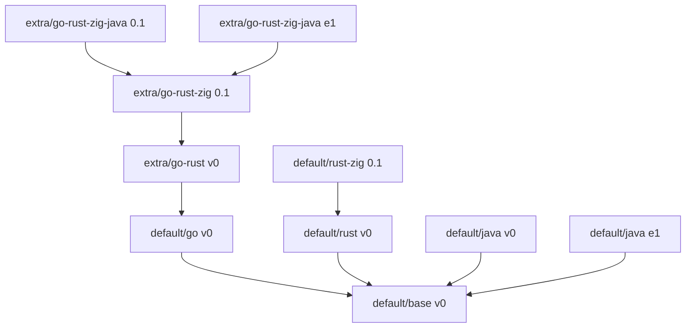

# Agents Docker Images

> Docker toolchain images for AI coding agents — batteries included, built by a data-driven Makefile and published via GitHub Actions.

The project ships a set of layered, versioned Docker images (`base`, `Go`, `Rust`, `Rust+Zig`, `Java`) plus ready-made **combinations** (`extra/*`) such as a full Go + Rust + Zig + Java workspace. Every image is defined by a small `.meta` file — the single source of truth — and images are built, validated and published by `make`.

---

## Highlights

- **10 images, 1 command to build them all** — `make build` discovers every image from its `.meta` file.
- **Dependency-aware builds** — `PARENT=` in `.meta` drives build ordering and `BASE_IMAGE` propagation.
- **Reuse instead of copy** — `DOCKERFILE=` in `.meta` lets an image reuse an existing Dockerfile (see `extra/*`).
- **Idempotent publishing** — already-published tags are skipped via a registry manifest probe; overwrite only with `ALLOW_OVERWRITE=true`.
- **Change-aware CI** — GitHub Actions builds and pushes only images affected by a commit (plus their transitive dependents).
- **Safe by default** — non-root `coder` user, pinned toolchain versions, cached archives removed after install, multi-arch (amd64/arm64).

---

## Available images

| Image                    | Version | Contents                                                                | Built on            | Pull                                                                       |
| ------------------------ | ------- | ----------------------------------------------------------------------- | ------------------- | -------------------------------------------------------------------------- |
| `default/base`           | `v0`    | Debian 12 slim, common CLI/editors/debug tools, Python 3, Node.js 22    | debian:12-slim      | `docker pull ghcr.io/alexundros/agents-docker-images/base:v0`              |
| `default/go`             | `v0`    | Go 1.26.7 (official tarball, trimmed)                                   | `default/base`      | `docker pull ghcr.io/alexundros/agents-docker-images/go:v0`                |
| `default/rust`           | `v0`    | Rust `stable` via rustup (minimal), gnu + musl targets, C toolchain     | `default/base`      | `docker pull ghcr.io/alexundros/agents-docker-images/rust:v0`              |
| `default/rust-zig`       | `0.1`   | Zig 0.14.0 (mirror-fallback) + cargo-zigbuild 0.23.3                    | `default/rust`      | `docker pull ghcr.io/alexundros/agents-docker-images/rust-zig:0.1`         |
| `default/java`           | `v0`    | SDKMAN: JDK 8 / 11 / 17 / 21 (Temurin), Maven 3.9.16, Gradle 9.7.1      | `default/base`      | `docker pull ghcr.io/alexundros/agents-docker-images/java:v0`              |
| `default/java`           | `e1`    | SDKMAN: JDK 8 / 11 / 17 / 21 / 26 (Temurin) + GraalVM 21, Maven, Gradle | `default/base`      | `docker pull ghcr.io/alexundros/agents-docker-images/java:e1`              |
| `extra/go-rust`          | `v0`    | Go + Rust (reuses `default/rust` Dockerfile)                            | `default/go`        | `docker pull ghcr.io/alexundros/agents-docker-images/go-rust:v0`           |
| `extra/go-rust-zig`      | `0.1`   | Go + Rust + Zig (reuses `default/rust-zig` Dockerfile)                  | `extra/go-rust`     | `docker pull ghcr.io/alexundros/agents-docker-images/go-rust-zig:0.1`      |
| `extra/go-rust-zig-java` | `0.1`   | Go + Rust + Zig + Java/Maven/Gradle (reuses `default/java` Dockerfile)  | `extra/go-rust-zig` | `docker pull ghcr.io/alexundros/agents-docker-images/go-rust-zig-java:0.1` |
| `extra/go-rust-zig-java` | `e1`    | Go + Rust + Zig + Java incl. JDK 26 + GraalVM (reuses `default/java`)   | `extra/go-rust-zig` | `docker pull ghcr.io/alexundros/agents-docker-images/go-rust-zig-java:e1`  |

### Dependency graph

---

## Documentation

- [**Image contents**](docs/image-contents.md) — detailed breakdown of every image and its versions (packages, toolchains, ENV, size optimizations, `extra/*` combinations).
- [**Build system & Makefile**](docs/build-system.md) — how the build system works, the `.meta` reference, the full Makefile reference, and how to add a new image.
- [**CI/CD (GitHub Actions)**](docs/ci-cd.md) — the `build-images` and `dump-contexts` workflows: triggers, change detection, and the build-and-publish pipeline.

---

## Security & best practices

- **Non-root by default** — everything runs as the `coder` user (UID/GID 1001).
- **Pinned versions** — toolchains are versioned in `.meta`/Dockerfile ARGs and bumped deliberately.
- **Smaller layers** — Go test/doc/misc, per-JDK `src.zip`, rustup tmp and SDKMAN download caches are removed during builds.
- **Configurable mirrors** — regional apt mirrors and a Zig mirror fallback list (`assets/zig-mirrors.txt`) for reliable downloads.
- **No registry overwrites** — published versions are immutable unless `ALLOW_OVERWRITE=true` is set explicitly.

---

## License

MIT
