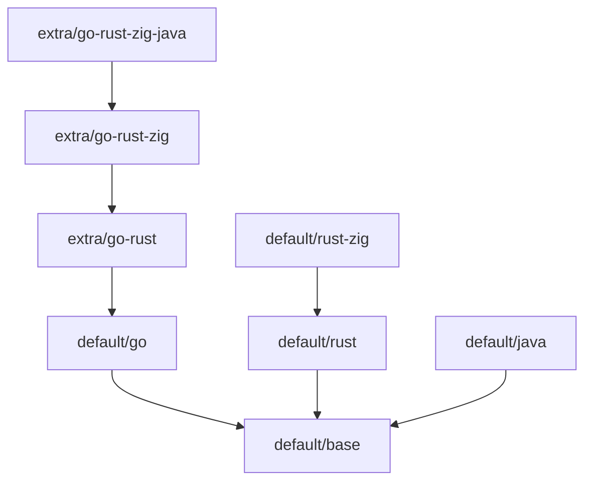

# Agents Docker Images

> Docker toolchain images for AI coding agents — batteries included, built by a data-driven Makefile and published via GitHub Actions.

The project ships a set of layered, versioned Docker images (`base`, `Go`, `Rust`, `Rust+Zig`, `Java`) plus ready-made **combinations** (`extra/*`) such as a full Go + Rust + Zig + Java workspace. Every image is defined by a small `.meta` file — the single source of truth — and images are built, validated and published by `make`.

---

## Highlights

- **8 images, 1 command to build them all** — `make build` discovers every image from its `.meta` file.
- **Dependency-aware builds** — `PARENT=` in `.meta` drives build ordering and `BASE_IMAGE` propagation.
- **Reuse instead of copy** — `DOCKERFILE=` in `.meta` lets an image reuse an existing Dockerfile (see `extra/*`).
- **Idempotent publishing** — already-published tags are skipped via a registry manifest probe; overwrite only with `ALLOW_OVERWRITE=true`.
- **Change-aware CI** — GitHub Actions builds and pushes only images affected by a commit (plus their transitive dependents).
- **Safe by default** — non-root `coder` user, pinned toolchain versions, cached archives removed after install, multi-arch (amd64/arm64).

---

## Quick start

```bash
# Build every image locally
make build

# Run the Java-capable full stack image
docker run --rm -it <image-prefix>/go-rust-zig-java:v0

# Start a session in a Go image
docker run --rm -it <image-prefix>/go:v0 bash
```

Every image runs `info-banner.sh` by default, which prints the environment, installed tools, and system info.

---

## Available images

| Image                    | Contents                                                               | Built on            | Pull                                                                          |
| ------------------------ | ---------------------------------------------------------------------- | ------------------- | ----------------------------------------------------------------------------- |
| `default/base`           | Debian 12 slim, common CLI/editors/debug tools, Python 3, Node.js 22   | debian:12-slim      | `docker pull ghcr.io/alexundros/agents-docker-images/base:latest`             |
| `default/go`             | Go 1.26.7 (official tarball, trimmed)                                  | `default/base`      | `docker pull ghcr.io/alexundros/agents-docker-images/go:latest`               |
| `default/rust`           | Rust `stable` via rustup (minimal), gnu + musl targets, C toolchain    | `default/base`      | `docker pull ghcr.io/alexundros/agents-docker-images/rust:latest`             |
| `default/rust-zig`       | Zig 0.14.0 (mirror-fallback) + cargo-zigbuild 0.23.3                   | `default/rust`      | `docker pull ghcr.io/alexundros/agents-docker-images/rust-zig:latest`         |
| `default/java`           | SDKMAN: JDK 8 / 11 / 17 / 21 (Temurin), Maven 3.9.16, Gradle 9.7.1     | `default/base`      | `docker pull ghcr.io/alexundros/agents-docker-images/java:latest`             |
| `extra/go-rust`          | Go + Rust (reuses `default/rust` Dockerfile)                           | `default/go`        | `docker pull ghcr.io/alexundros/agents-docker-images/go-rust:latest`          |
| `extra/go-rust-zig`      | Go + Rust + Zig (reuses `default/rust-zig` Dockerfile)                 | `extra/go-rust`     | `docker pull ghcr.io/alexundros/agents-docker-images/go-rust-zig:latest`      |
| `extra/go-rust-zig-java` | Go + Rust + Zig + Java/Maven/Gradle (reuses `default/java` Dockerfile) | `extra/go-rust-zig` | `docker pull ghcr.io/alexundros/agents-docker-images/go-rust-zig-java:latest` |

### Dependency graph



---

## Image contents

### `default/base` — the common layer

- **OS**: Debian 12 (bookworm) slim; apt mirrors are configurable via `APT_MIRROR` / `APT_SEC_MIRROR` (regional mirror by default).
- **Shell & VCS**: bash, curl, wget, git.
- **Archivers**: zip, unzip.
- **Search & CLI**: fzf, fd (`fd` alias), ripgrep, jq.
- **Editors & TUI**: nano, vim, neovim, mc (Midnight Commander).
- **Network & debug**: net-tools, iputils-ping, strace, lsof, tcpdump.
- **System info**: procps (`free`, `nproc`, …).
- **Dev libraries**: libssl-dev, zlib1g-dev, libffi-dev.
- **Languages**: Python 3 (pip, venv), Node.js 22 (NodeSource LTS).
- **User**: non-root `coder` (UID/GID 1001), workdir `/home/coder`.

### `default/go`

Go 1.26.7 from the official tarball (amd64/arm64), `GOPATH=/home/coder/go`, toolchain trimmed of `test/doc/misc`.

### `default/rust`

Rust `stable` installed via rustup (minimal profile) with targets `x86_64-unknown-linux-gnu` and `x86_64-unknown-linux-musl`, plus `build-essential`, `musl-tools` and `xz-utils`.

### `default/rust-zig`

Zig 0.14.0 downloaded from a shuffled mirror list (see `assets/zig-mirrors.txt`, overridable via `ZIG_MIRROR`) and a prebuilt cargo-zigbuild 0.23.3 binary — no source compilation, no cargo registry cache.

### `default/java`

JDKs 8, 11, 17 and 21 (Temurin) managed by **SDKMAN**, JDK 21 as the default (`JAVA_HOME`, `java`/`javac` on PATH), plus Maven 3.9.16 and Gradle 9.7.1. Per-JDK `src.zip` and the SDKMAN download cache are removed to save ~1 GB.

### `extra/*` — combinations

`extra` images carry **no Dockerfile of their own**; they reuse an existing one via `DOCKERFILE=` and layer it onto a richer parent, e.g.:

```text
# extra/go-rust/v0/.meta
DOCKERFILE=default/rust/v0/Dockerfile
PARENT=default/go/v0
```

This is how a full `go-rust-zig-java` workspace is produced from three shared Dockerfiles.

---

## How the build system works

The Makefile is the engine. Images live under `dockerfiles/` as `<namespace>/<key>/<version>/`, and each directory contains:

```
dockerfiles/<namespace>/<key>/<version>/
├── .meta          # ← the main file (required, drives everything)
└── Dockerfile     # optional — can be shared/reused via DOCKERFILE=
```

### `.meta` reference

| Key           | Purpose                                                                                                 |
| ------------- | ------------------------------------------------------------------------------------------------------- |
| `PARENT=`     | Image this image is built on (`<key>/<version>`). Builds parents first and passes them as `BASE_IMAGE`. |
| `DOCKERFILE=` | Path to a Dockerfile relative to `dockerfiles/`. If unset, the conventional `<id>/Dockerfile` is used.  |
| `ARG_<NAME>=` | Converted to `--build-arg <NAME>=<value>` for `docker build`.                                           |
| `IMAGE=`      | Optional image-name override (used to disambiguate duplicate basenames).                                |

Images are **discovered from `.meta` files**, so the layout is validated at parse time (`make validate`): layout sanity, duplicate image names, `PARENT` references, and Dockerfile existence (resolved through `DOCKERFILE=`).

---

## Makefile reference

Run `make help` for the full list.

| Target                           | Description                                                        |
| -------------------------------- | ------------------------------------------------------------------ |
| `make validate`                  | Validate layout, duplicate names, PARENT refs and Dockerfile paths |
| `make images`                    | List all discovered images with their refs and parents             |
| `make build`                     | Build all images locally                                           |
| `make build-<id>`                | Build one image (e.g. `build-extra/go-rust-zig-java`)              |
| `make build-<key>`               | Build all versions of a key (e.g. `build-extra`)                   |
| `make release`                   | Build **and push** every image (skips published tags)              |
| `make release-<id>`              | Build and push one image                                           |
| `make push`                      | Push already-built images (skips published tags)                   |
| `make login`                     | Log in to the registry                                             |
| `make save` / `make load`        | Export/import images to/from `dist/*.tar.gz`                       |
| `make clean` / `make clean-dist` | Remove built images / the `dist/` directory                        |

### Key variables

| Variable                           | Default       | Description                                                                         |
| ---------------------------------- | ------------- | ----------------------------------------------------------------------------------- |
| `REGISTRY`                         | *(empty)*     | Container registry (e.g. `ghcr.io`). Together with `NAMESPACE` enables remote refs. |
| `NAMESPACE`                        | *(empty)*     | Repository/namespace, e.g. `acme/agents-images`                                     |
| `PUSH_LATEST`                      | `false`       | Also tag/push `:latest`                                                             |
| `ALLOW_OVERWRITE`                  | `false`       | Rebuild/republish existing versions                                                 |
| `OCI_SOURCE` / `OCI_REVISION`      | — / `local`   | OCI labels (`source`, `revision`)                                                   |
| `IMAGE_PREFIX`                     | *(empty)*     | Prefix for image names                                                              |
| `DF_DIR`                           | `dockerfiles` | Directory containing image definitions                                              |
| `BUILD_CONTEXT`                    | `.`           | Docker build context                                                                |
| `REGISTRY_USER` / `REGISTRY_TOKEN` | —             | Credentials for `make login`                                                        |

### Examples

```bash
# Local build of a single image
make build-extra/go-rust-zig-java

# Build everything
make build

# Publish new versions to a registry (existing tags are skipped)
make release REGISTRY=ghcr.io NAMESPACE=acme

# Force-rebuild + update :latest tags
make release REGISTRY=ghcr.io NAMESPACE=acme PUSH_LATEST=true ALLOW_OVERWRITE=true

# Export / import images for air-gapped transfer
make save
make load
```

---

## CI/CD (GitHub Actions)

The `build-images` workflow handles the full build-and-publish lifecycle.

**Triggers**

- `push` to `main` when `dockerfiles/**` changes — builds **and publishes** only the new/changed versions (existing tags are never overwritten).
- `workflow_dispatch` (manual) with inputs:
  - `push` — publish to the registry (default `true`);
  - `push_latest` — also update `:latest` tags;
  - `force_rebuild` — rebuild everything even if already published.

**How it works**

1. **Detect changed images** — for pushes, the workflow diffs `dockerfiles/`, maps changed files to image IDs, and transitively includes dependent images (children of a changed parent are rebuilt too).
2. **Validate** — `make validate`.
3. **Build** — `make build-<id>` (build-only) or `make release-<id>` (build + push).
4. **Push** — logs in with `docker/login-action` using the repo's `REGISTRY`, `REGISTRY_USER` (vars) and `REGISTRY_TOKEN` (secret), then releases the affected images.

A companion `dump-contexts` workflow prints the full GitHub/runner environment — handy for debugging runners, docker config and shell setup.

---

## Adding a new image

1. Create `dockerfiles/<namespace>/<key>/<version>/.meta`:

   ```text
   PARENT=default/base/v0

   # Build args passed to the Dockerfile
   ARG_GO_VER=1.26.7
   ```

2. Add a `Dockerfile` next to it — **or** reuse an existing one by setting `DOCKERFILE=`.

3. Verify and build:

   ```bash
   make validate
   make build-<namespace>/<key>/<version>
   ```

The image is automatically picked up by discovery, the aggregate targets, `save`/`load`, and CI.

---

## Security & best practices

- **Non-root by default** — everything runs as the `coder` user (UID/GID 1001).
- **Pinned versions** — toolchains are versioned in `.meta`/Dockerfile ARGs and bumped deliberately.
- **Smaller layers** — Go test/doc/misc, per-JDK `src.zip`, rustup tmp and SDKMAN download caches are removed during builds.
- **Configurable mirrors** — regional apt mirrors and a Zig mirror fallback list (`assets/zig-mirrors.txt`) for reliable downloads.
- **No registry overwrites** — published versions are immutable unless `ALLOW_OVERWRITE=true` is set explicitly.

---

## License

MIT
